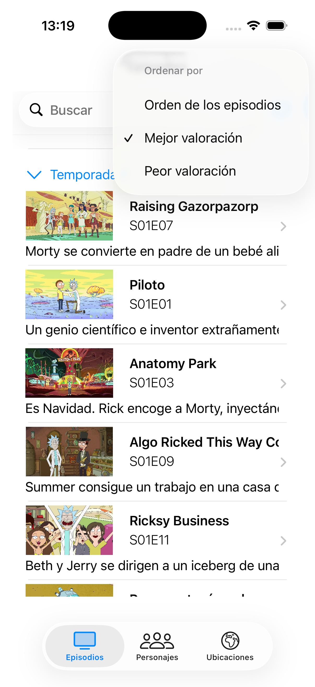
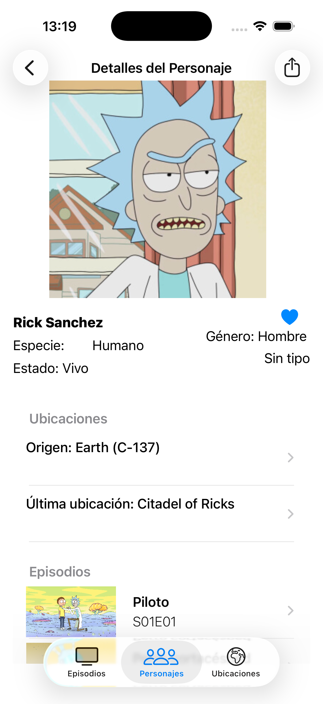
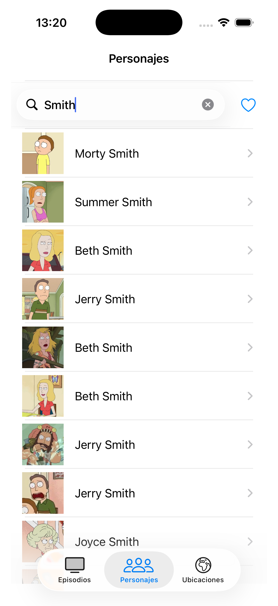
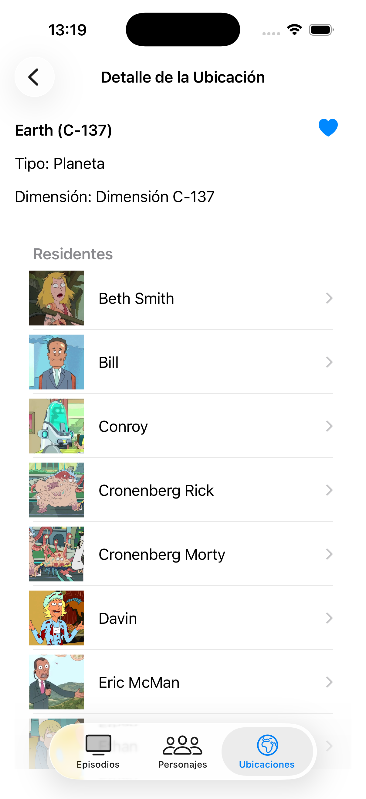
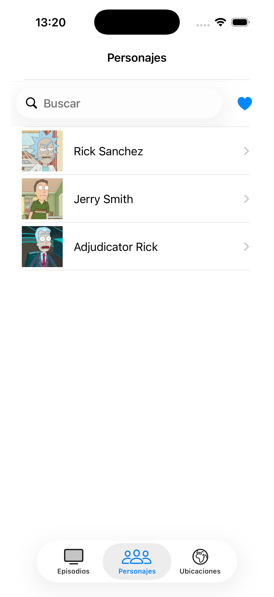
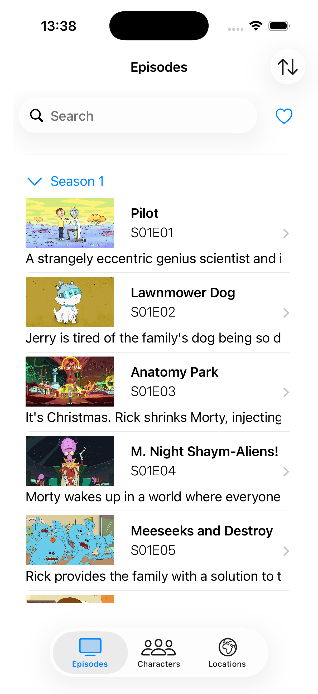

# Rick and Morty iOS App

Aplicación nativa desarrollada con **Swift y UIKit** para explorar personajes, episodios y ubicaciones del universo de *Rick and Morty*.

       

> Proyecto formativo durante mis prácticas en **Plexus Tech**, bajo la mentoría de un desarrollador iOS senior. El desarrollo partió de una serie de requisitos definidos y revisados por el mentor, que también realizó seguimiento de la calidad, limpieza y organización del código.

## ¿Qué permite hacer?

La barra inferior divide la aplicación en tres apartados:

* **Episodios:** consulta por temporadas, búsqueda, ordenación y acceso al detalle.
* **Personajes:** búsqueda, favoritos e información sobre origen, ubicación y episodios.
* **Ubicaciones:** consulta de dimensiones y acceso a sus personajes residentes.

Las pantallas están conectadas entre sí. Desde el detalle de un personaje puedes navegar a sus ubicaciones o episodios; desde una ubicación puedes abrir cualquiera de sus residentes.

La aplicación también dispone de:

* Sistema de favoritos para personajes, episodios y ubicaciones.
* Caché de datos e imágenes para reducir peticiones de red.
* Búsqueda y carga progresiva.
* Contenido compartido.
* Datos combinados de Rick and Morty API e IMDb API.
* Traducción a inglés, español y portugués.
* Pruebas unitarias con XCTest.

## Stack

`Swift` · `UIKit` · `XIB` · `MVVM` · `Coordinators` · `Dependency Injection` · `Repository Pattern` · `URLSession` · `XCTest`

Se utiliza una **arquitectura MVVM**, los Coordinators controlan el flujo de navegación y los casos de uso aíslan la lógica de negocio. Los repositorios abstraen el origen de los datos y las dependencias se resuelven mediante protocolos, facilitando el desacoplamiento y las pruebas.

APIs utilizadas:

* [The Rick and Morty API](https://rickandmortyapi.com/)
* [IMDb API](https://imdbapi.dev/)
* Servicio de traducción para el contenido remoto
